# EMC Galaxy Training: Cancer Analysis

This practical will demonstrate some tools for the detection and visualisation of fusion genes, and how to discriminate somatic from germline mutations in a tumour in the absense of a matched normal. It will also demonstrate the use of the iReport tool for generating HTML reports within Galaxy, and demonstrate an example of a end-to-end workflow in Galaxy.


## Preparations
1. **Open Galaxy**

  Please open a web browser and navigate to the Galaxy server:

  https://bioinf-galaxian.erasmusmc.nl/galaxy

  It is recommended that you use Firefox or Chrome for this tutorial (not IE)

2. **Log in to your account**

   In the top menu bar, go to User and then choose Login. The instructors will provide you with login credentials.


## 0. Full Workflow (setup)
There is a full workflow of all the steps in this practical available on the Galaxy server. This workflow takes as input small variant data (SNPs and InDels), large structural variant (breakpoint) data (SVs), and copy number data, and runs several analyses, annotations and visualisation tools, and finally presents all results as an interactive iReport.

Because a full run of the pipeline can take quite some time (even with the smaller datasets we use), we will start this workflow now, and come back to it at the end of this session. In the meantime we will perform the pipeline steps manually to get a sense of what all the tools do.

- **Get data** for this practical session
  - First, create a new history, and give it a name.
  - Navigate to the data library named `EMC Training - Cancer Analysis` and import the following datasets:
  ```
  highConfidenceJunctions_VCaP.tsv  (Structural Variants)
  masterVar_VCaP_chr22.tsv          (Small Variants)
  VCaP_copynumber.tsv               (Copy Number)
  VCaP_B-alleleFrequency.txt        (B-allele Frequency)
  ```

We use Complete Genomics data for this example. Aside from being able to handle the standard file formats (e.g. VCF), most of our tools can also handle Complete Genomics own data formats.


- **Start the workflow**
  - Go to `Shared Data → Workflows`
  - Click on the workflow `EMC Training: Integrative workflow with iReport`.
  - Import the workflow (`+` symbol on top-right). A copy of the workflow is now available from your own workflow menu (`Workflow` on top menu bar).
  - Start the workflow. Choose the appropriate files as inputs

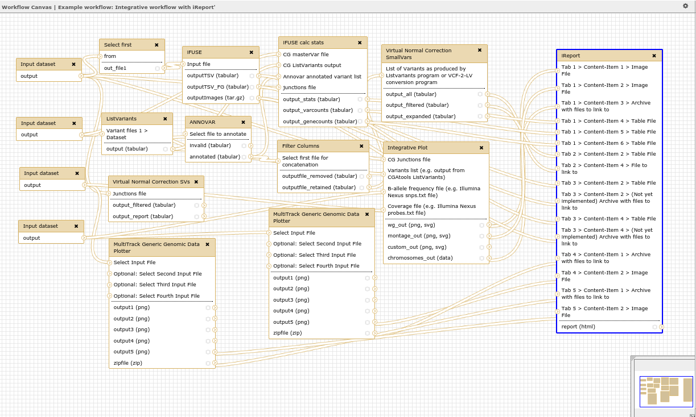

We will return to this history to view the results at the end of the session

- Start a new history before proceeding to the next parts.
- Import the same data again from the data library to this new history

In the following sections, we will run parts of the workflow manually, to get a sense of the data and tools we are dealing with.

## VCaP Sample

In this tutorial we will use data from the VCaP prostate cancer cell line, which was whole-genome  sequenced by [Complete Genomics](http://www.completegenomics.com/).

Prostate cancer tissue was harvested at autopsy from a metastatic lesion to a lumbar vertebral body of a patient with hormone refractory prostate cancer. This tissue was aseptically xenografted into SCID mice and later harvested and plated on tissue culture dishes

##  Visualisation

1. **Generic Genomic Data Plotter**
  - This tool will plot any data of format `chr – start – end – value`.
  - Let's plot the B-allele frequency data:
  ```
    Tool: Visualisation → Multitrack Generic Genomic Data Plotter
      - Genome Build: hg18
    	- Input File: VCaP_B-alleleFrequency.txt
    	- Select Chromosome: chr5
    	- Execute
    ```
  - View the resulting image by clicking on the eye icon.
  - Now rerun the tool on all chromosomes at once (tip: use the rerun button on the previous dataset)
  - Also plot the copy number data. Because the copynumber values ranges from -1 to 1, don't forget   to set the Ymin value to -1 for this!

  **Note**: this tool also supports plotting of multiple tracks (e.g. tumour and normal in one plot)

2. **Circos**
  - This tool will plot our data in a circular plot.
  - First we need to convert the Complete Genomics MasterVar file format to a simple list of variants:
  ```
  Tool: CGATools → Listvariants
  	- Reference Genome: Build 36
  	- select input file type: mastervar
  	- add an input file, select the file “masterVar_VCaP_chr22.tsv”
  	- everything else default
  	- Execute
  ```
  - Now we are ready to plot all this data with Circos:
  ```
  Tool: Visualisation → Integrative plot
  	- CG Junctions File: highConfidenceJunctions_VCaP.tsv
  	- Variant List: output from Listvariants tool you just generated
  	- B-allele frequency file: VCaP_B-alleleFrequency.txt
  	- Coverage File: VCaP_copynumber.txt
  	- Generate only Whole-genome plot (uncheck the rest)
  	- Execute
  ```
  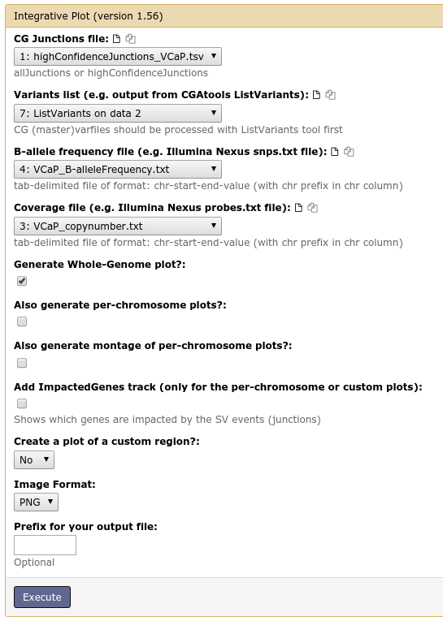

  When the tool is finished, click on the eye icon to view the resulting circos plot. Because the image is so large, it is inconvenient to view in Galaxy's center pane. The view can be improved by opening it in a separate tab (right-click the eye icon and open in new tab or window).

  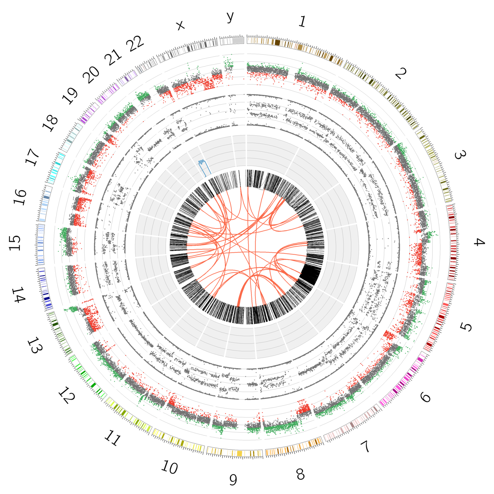

  - **Explanation** of plot:
    * The outer ring depicts the copy number (green= gain, red=loss).
    * The second ring from the outside depicts the B-allele Frequency, ranging from 1 (100% alt bases) to 0 (100% reference bases). For normal diploid genomes you would expect the B-alleleFrequency to always be at either 0, 0.5, or 1 (homozygous reference, heterozygous and homozygous non-reference respectively)
    * The next ring indicates SNP density (our file only contained data on chromosome 22 for speed purposes)
    * The innermost ring shows the breakpoints (red=interchromosomal, black= intrachromosomal)


  - Pick one or more interesting-looking chromosomes, and run the tool again, this time selecting only those chromosomes of interest by defining a *custom region* to plot. For these plots, it is also possible to add a track with impacted genes. This will write the names of all genes impacted by a breakpoint (large structural variation) around the outer edge of the plot:
  ```
  Tool: Visualisation → Integrative plot
  	- CG Junctions File: highConfidenceJunctions_VCaP.tsv
  	- Variant List: output from Listvariants tool you just generated
  	- B-allele frequency file: VCaP_B-alleleFrequency.txt
  	- Coverage File: VCaP_copynumber.txt
  	- Add impacted genes track: check (uncheck all other checkboxes)
  	- Create a plot of a custom region?: Yes
  		Region: chr1;chr2  (choose whichever chromosomes you like)
  	- Execute
  ```


- If you did not pick chromosome 5 in the previous step, plot it now. (use similar settings as previous step, but select only `chr5` in the custom region)

Look at the resulting image, here you can clearly see something weird is going on with chromosome 5. VCaP shows chromothripsis (shattering) of (one arm of) chromosome 5.

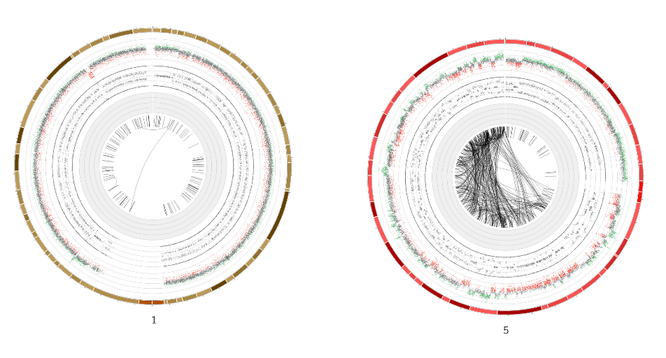


## Virtual Normal
The VCaP sample we have been using does not have a matching normal. In an effort to discriminate germline variants from somatic variants, we can use a *virtual normal*.

Normally you would use a very large VN set (433 genomes currently). However, processing can take several hours, so for this tutorial, you will use a small virtual normal, consisting of 10 genomes. These genomes were sequenced by Complete Genomics within the 1000 Genomes project, and all samples are from healthy, unrelated individuals.

- Structural variants

  ```
  Tool: Virtual Normal Analysis → Virtual Normal Correction SVs
   	- Virtual Normal to use: Small Virtual Normal hg18 (practical)
   	- Junctions file: highConfidenceJunctions_VCaP.tsv
   	- Generate report file? Yes
  	- Execute
  ```

  - The output is a filtered list of junctions. Compare this list with the original input file. How many junctions were removed in this step?

- Small variations
  We do the same filtering for the small variants. This tool uses the Complete Genomics tool *TestVariants* repeatedly to find overlap between variants, even when they are called in slightly different ways.

  Because this tool does not perform simple position-based comparison, it is quite time consuming, first lets' further restrict our input file by only selecting the first few variants.

  ```
  Tool: Text Manipulation → Select first
  	- Select first: 10
  	- From: Listvariants output we created for the circos tool
  	- Execute
  ```  

  Now we run the virtual normal correction on this small dataset:

  ```
   Tool: Virtual Normal Analysis → Virtual Normal Correction SmallVars
  	- List of variants: The short file you just  created
  	- Virtual normal to use: Small Virtual Normal hg18 (practical)
  	- Filter variants if present in at least this number of background genomes: 1
  	- Execute
  ```

  This tool outputs 3 files:

  1. **All Variants**
  Lists all variants, along with annotations of the number of times we encountered them in the Virtual normal set. The columns added are:
    - *VN_occurences*: count of number of genomes in virtual normal that had this variant
    - *VN_frequence*: percentage of all VN genomes showing this variant
    - *VN_fullycalled_count*: number of genomes in virtual normal for which this locus was fully called
    - *VN_fullycalled_frequency*: % of genomes in virtual normal for which this locus was fully called
    - *VN_00,VN_01, etc*: number of genomes showing particular genotype: 11=homozygous variant, 01=heterozygous, 00=variant not present on either allele etc.

  2. **Filtered Variants**
  Same file as above, but variant were removed if the VN_occurrences was higher than the threshold indicated by user.

  3. **Expanded Annotation**
  all variants, with information per VN genome


  **Note:** You can set a filter threshold, but the tool will also always outputs an unfiltered list, annotated with the number of occurrences in the VN set, so you can easily apply a different filter threshold afterwards (e.g. with one of the filter tools offered in Galaxy).

  **Note:** there is also a preprocessing tool available to convert VCF files to a format suitable for input for this tool.


## Fusion Genes
There are several tools available for the detection/analysis of large structural variations. These tools output a list of breakpoints (or junctions). *iFUSE* is a tool that takes as input a list of these breakpoints, and prioritizes those event that most likely represent a fusion gene. It visualises the event, and predicts DNA, RNA and protein sequence of the fusion gene. iFUSE runs as a standalone application here http://ifuse.erasmusmc.nl.

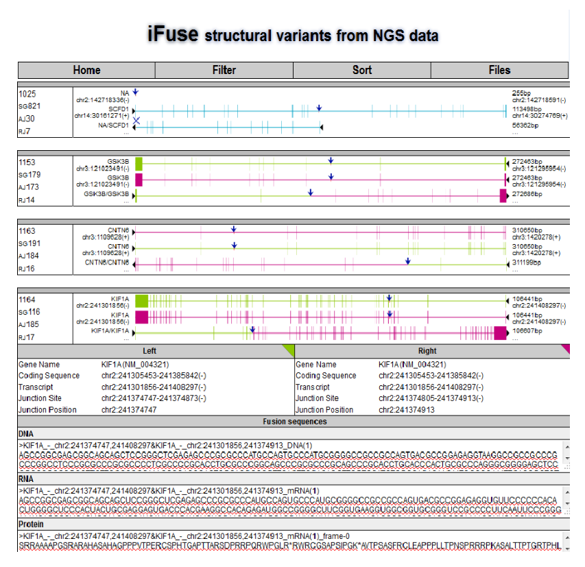

We have also imported iFUSE functionality to Galaxy.      

There is a small workflow available for running iFUSE in Galaxy. It first runs iFUSE, and then creates an iReport to display the results in an (interactive) HTML page.

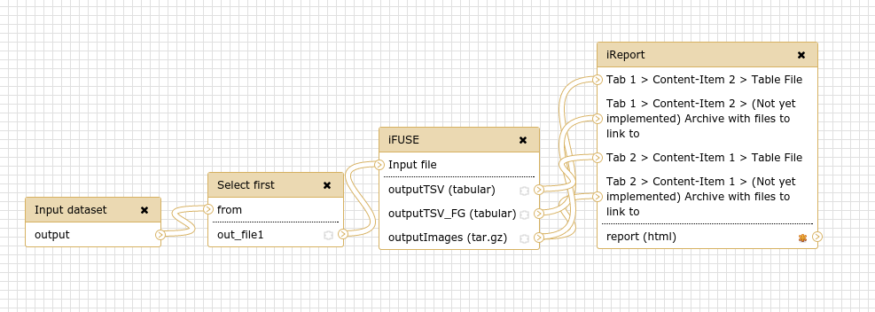

**NOTE:** For the sake of speed we included a step in this workflow that selects only the first 100 breakpoints.

- **Run this workflow** on the VCaP junctions

   - Workflow: `Shared Data → Published Workflows → EMC Training: iFUSE with iReport`
   - import this workflow, then go to your workflows, it should be in the list.
   - Start the workflow with the VCaP junctions as input file, and `VCaP` as the sample name.
   - When it has completed, click the eye icon on the output file `iReport: VCaP iFUSE Fusion Gene Explorer`

This shows you an iReport webpage, consisting of two tabs. Each tab has a table. This table can be searched and sorted. Clicking on the junction names will show more details about each event.

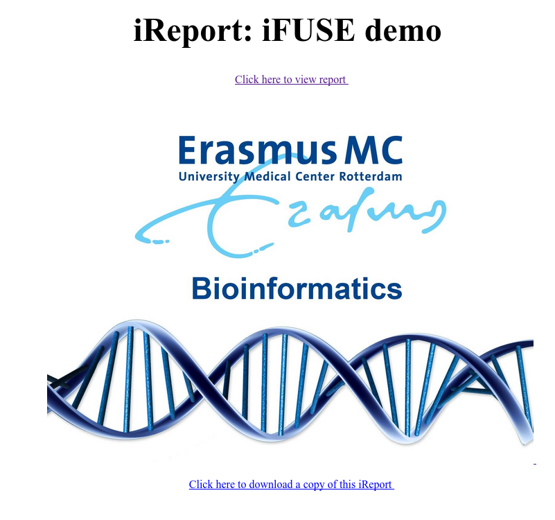
**Fig1:** Cover Page.

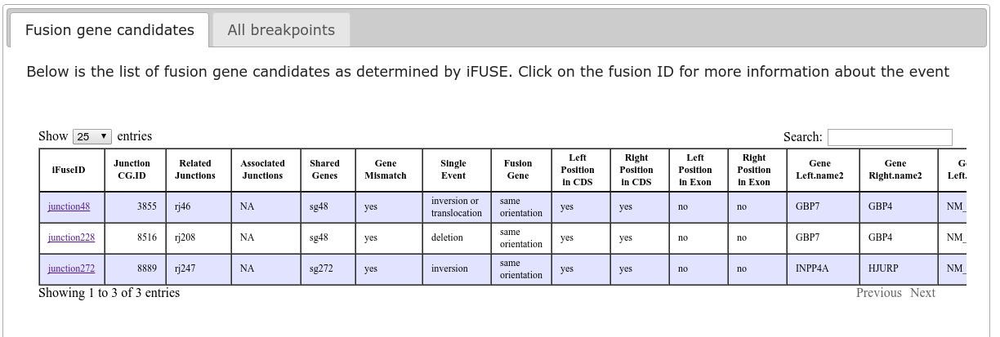
**Fig2:** Table with Fusion Gene Candidates. This table can be sorted by clicking on a column header.

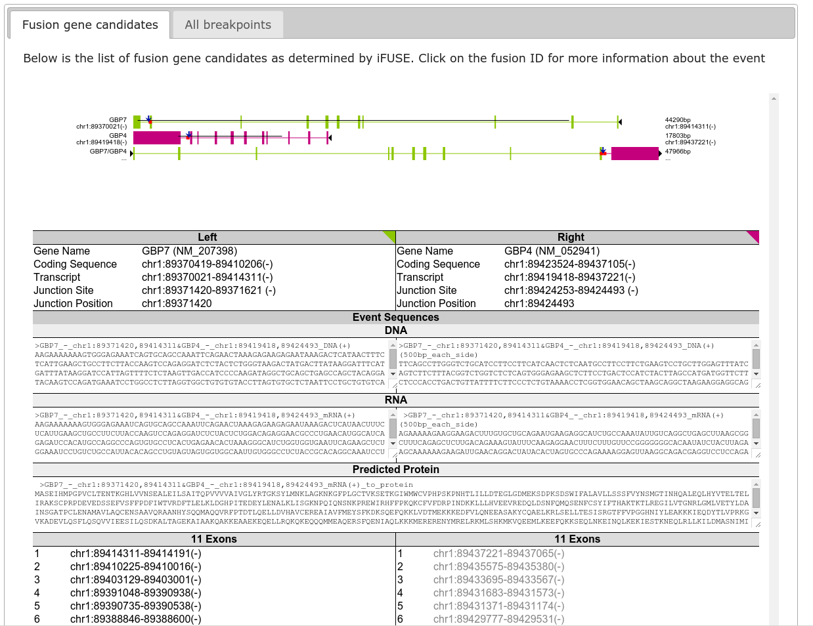
**Fig3:** When you click on a junction ID you get and iFUSE view of the event.


##  iReport

In the last section we presented the output from iFUSE in a webpage. We did this because the output from the iFUSE tool itself is rather cumbersome to view. iFUSE outputs two tabular files with breakpoints, and a zip-file filled with the images for each event and the predicted sequences.

Downloading all these files to your local machine for viewing is a lot of hassle. iReport solves this problem by combining the various output into a single view. iReport is very generic, and can fit on the end of every pipeline.

- **Introduction to iReports**

  Cover Page: Specify a title and optionally a URL to a cover image.
  Tabs: Add as many tabs as you like. Next add as many content items to each tab as you want.
  Content-items: Text/images/tables/PDF files/Links
  - **Images:** specify width, can add zoom-on-mouseover effect if desired
  - **PDF:** specify file. If your browser has PDF plugin, will be displayed in tab, otherwise 		download link is created
  - **Table:** Fancy table is sortable, searchable, and paginated. otherwise not.
  - **Text:** Just type into a text box. Useful for explaining the other content items (which tool 	was used, what does the output mean, etc)


- **Make your own simple iReport**

  **NOTE:** we strongly recommend using a browser that is not Internet Explorer for this part!
  In the data library for this part of the practical, you will find some different types of data you can put into an iReport, just to get some idea of how this works.

  - Start a new history
  - Import example files from data library. Import all files in the subfolder `iReport test data`
   	- 2 images (of the EMC)
   	- 1 pdf file	(of the iReport paper)
   	- 1 tabular file	(or the programme for this course)
  - Create an iReport. You are free to create whatever you like. Upload your own files if you like. Try to add at least 2 tabs, and include at least two content items on each tab. Remember, you can also add text as a content item!

Below are screenshots of a possible iReport. This example is also available as shared history, if you wish to see the parameter setting used here. `Shared Data → Published Histories → EMC Training - My First iReport`

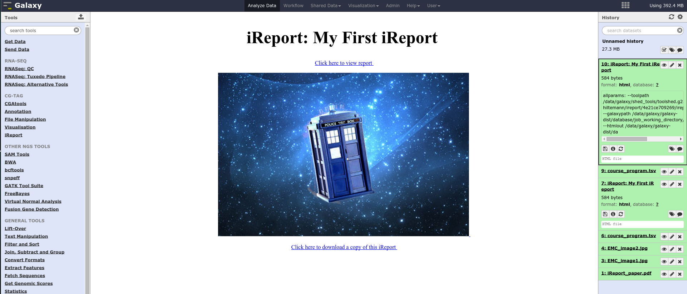
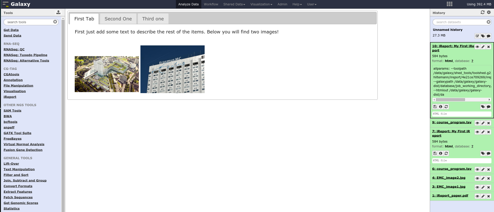
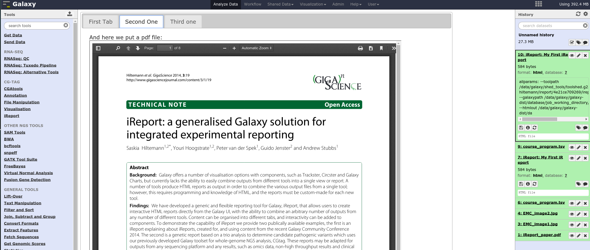
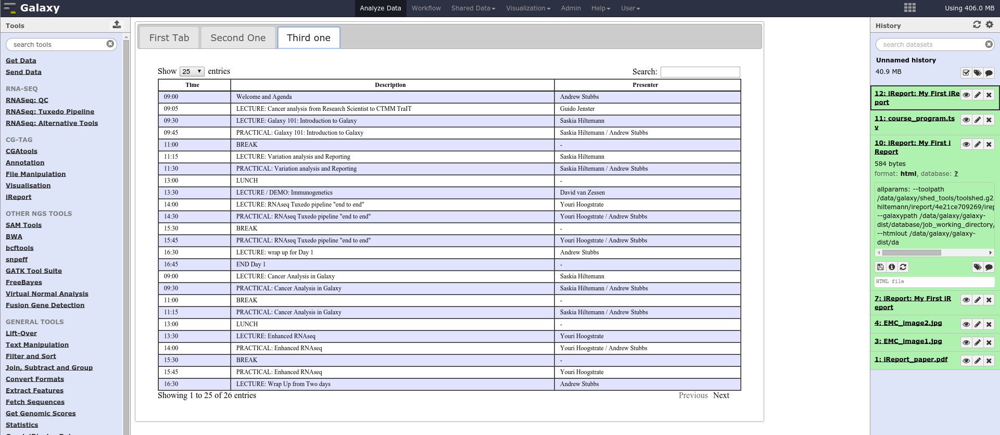

iReports can be a bit of work to make, but if you make them part of a workflow, the effort is only required once, and after that the outputs of a pipeline will automatically be presented to the user as an iReport every time.

## Full Workflow (view results)

Many of the workflows we build result in an iReport to present the results to the user. An example of such a workflow was the one you started at the beginning of this session. Let's return to this now (switch histories)

It is possible that your workflow will not have completed yet, if that is the case, import the published history belonging to this part of the practical and view that. `EMC Training - Cancer Analysis Example Workflow result`

Note that we added a few steps to filter some input files, to speed up the workflow enough to fit within this practical

 **Examine the final output**; the iReport generated from all output files (by clicking the eye icon).

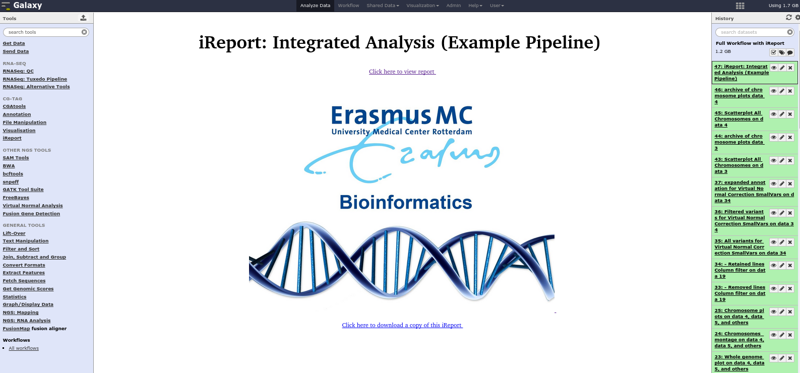
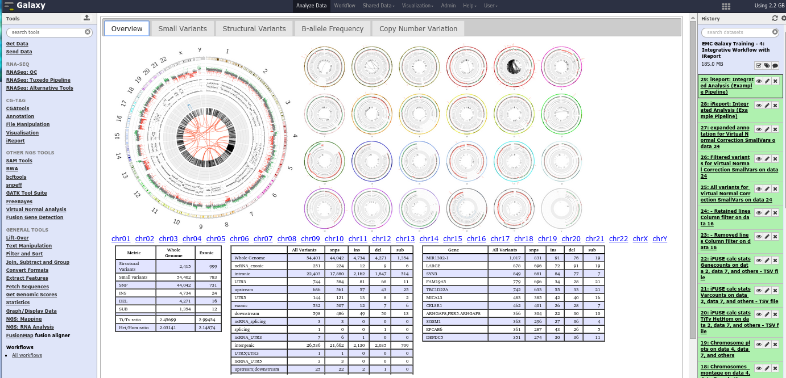
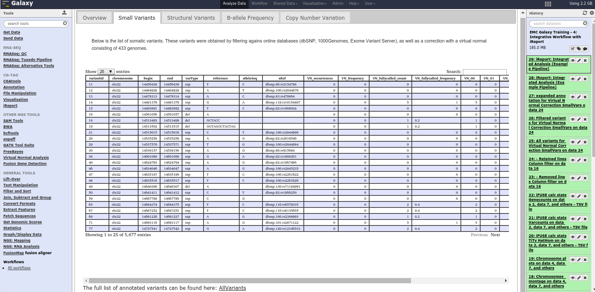
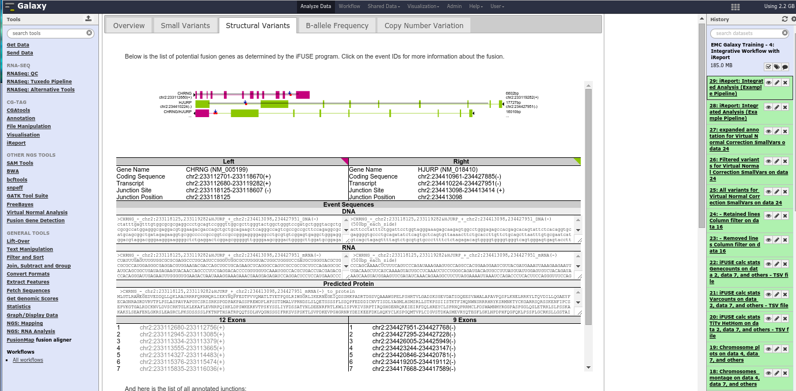
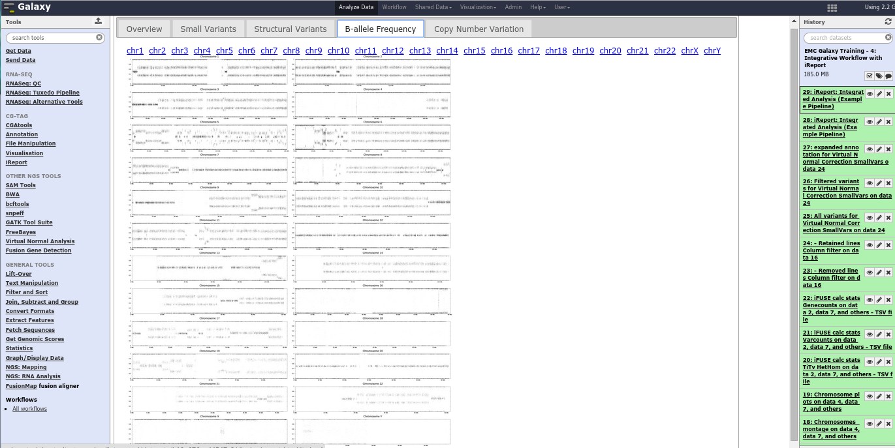

Any Galaxy users can now run this full workflow, needing only to provide the four input files, and they will be presented with an iReport like this one at the end to explore their results.

**THE END! Nice job!**
