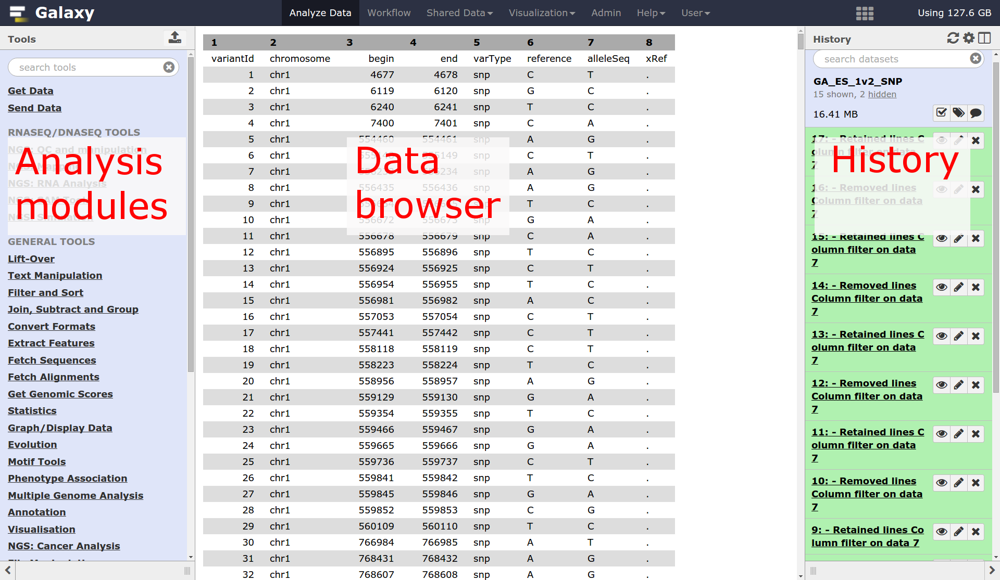
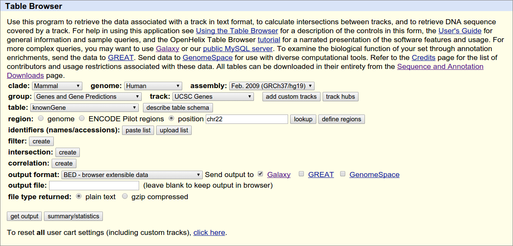
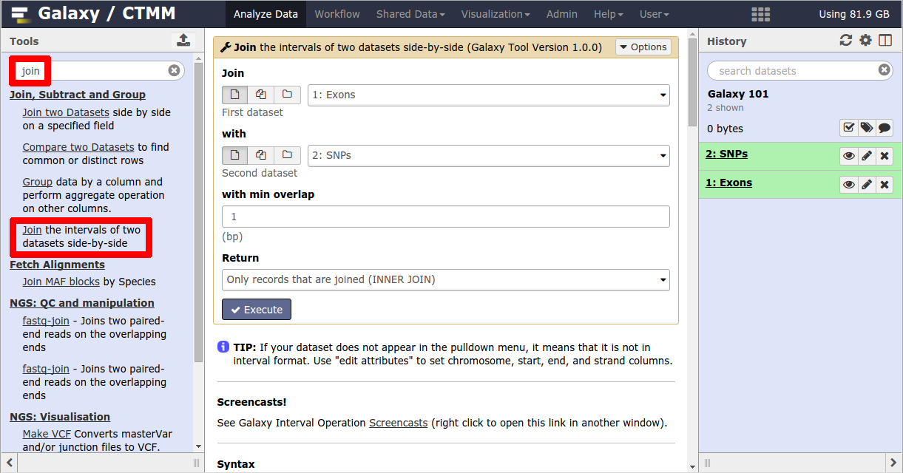
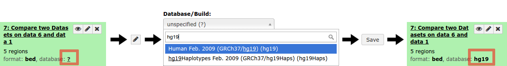
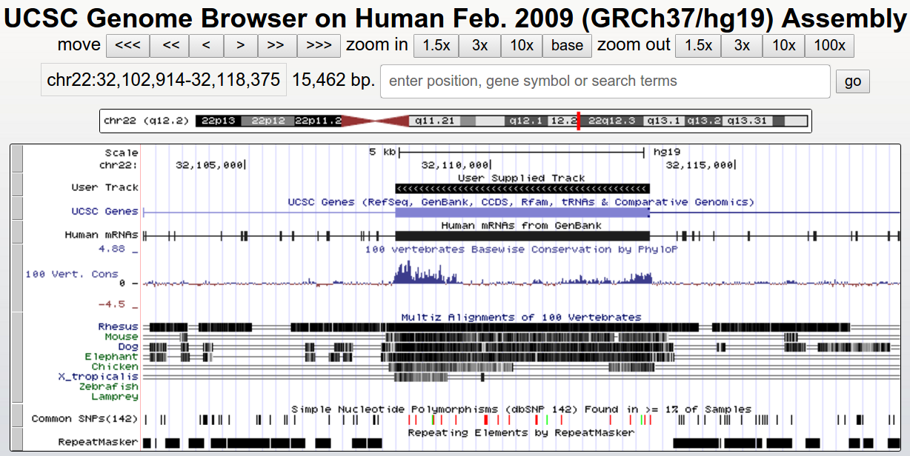
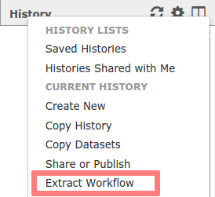

# EMC Galaxy Training: Intro to Galaxy

This practical aims to familiarize a user with the Galaxy user interface. It will teach how to perform basic tasks such as uploading data, running tools, working with histories, creating workflows, and sharing data.

This manual is inspired by the Galaxy-101 pages available at  
https://github.com/nekrut/galaxy/wiki/Galaxy101-1 and  
https://usegalaxy.org/u/galaxyproject/p/galaxy-variant-101.

**Note:** Due to the rapid development of Galaxy, some screen shots and results may differ slightly to yours.

## Preparations
1. **Open Galaxy**

  Please open a web browser and navigate to the Galaxy server:

  https://bioinf-galaxian.erasmusmc.nl/galaxy

  It is recommended that you use Firefox or Chrome for this tutorial (not IE)

2. **Log in to your account**

   In the top menu bar, go to User and then choose Login. The instructors will provide you with login credentials.


## Getting started
The time is there to play with Galaxy. The main screen consists of three parts, on the left is the list of available tools, on the right side the history pane showing the analysis you have performed so far and in the middle panel the tools and data visualizations.




## Galaxy 101: The first thing you should try
In this very simple example we will introduce you to bare basics of Galaxy:
- Getting data from UCSC
- Performing simple data manipulation
- Understanding Galaxy’s Tool and History system
- Creating and editing workflows
- Applying workflows to your data

Suppose you get the following question:

*Mom (or Dad) ... Which coding exon has the highest number of single nucleotide polymorphisms on chromosome 22?*

You think to yourself Wow! This is a simple question ... I know exactly where the data is (at UCSC) but how do I actually compute this? The truth is, there is really no straightforward way of answering this question in a time frame comparable to the attention span of a 7-year-old. Well ... actually there is and it is
called Galaxy. So let’s try it...

#### Getting data from UCSC genome browser
First thing we will do is to obtain data from UCSC by clicking `Get Data → UCSC Main`.


You will be taken to the UCSC table browser, which looks like this:



Make sure that your settings are exactly the same as shown on the screen:
- **assembly** should be set to Feb. 2009 (GRCh37/hg19)
- **position** should be set to `chr22`
- **output format** should be set to `BED - browser extensible data`
- **Send output to** should have the option `Galaxy` checked


Click `get output` and you will see the next screen:


Make sure *Create one BED record per* is set to `Coding Exons` and click `Send Query to
Galaxy`.

After this you will see your first History Item in Galaxy’s right pane. It will go through
gray (preparing/queued) and yellow (running) states to become green:


To view the contents of the file, click on the eye icon.


#### Gettings SNPs
Now is the time to obtain SNP data. This is done almost exactly the same way. First thing we will
do is to again click on `Get Data → UCSC Main`:


But now we change group to `Variation` to obtain the SNPs. It may be that a newer version of the Common SNPs database is available. It is not a big deal to select a different one than shown in the image, but your results may vary slightly.


Click `get output` to find a menu similar to this:


Make sure that `Whole Gene` is selected (Whole Gene here really means Whole Feature), and click `Send Query to Galaxy`. You will get your second item in your analysis history:


Now we will rename the two datasets to `Exons` and `SNPs` by clicking on the pencil icon
for each item. Also rename history to `Galaxy 101` (or anything else you want) by
clicking on `Unnamed history` so everything looks like this:


If the import from UCSC takes too long or something else went wrong, the files can also be
found as shared data library in Galaxy:
- In the top menu, go to `Shared Data → Data Libraries`
- Navigate to `EMC Training - Galaxy101` , and select the files named `SNPs` and `Exons` from
the `Datasets` subdirectory
- Next choose `to History`.
- Click on `Analyze Data` in the top menu bar to return to your analysis


#### Finding Exons with the highest number of SNPs

Let’s remind ourselves that our objective was to find which exon contains the most SNPs. This  first step in answering this question will be joining exons with SNPs (a fancy word for printing exons and SNPs that overlap side by side). This is done using the tool `Join the intervals of two datasets side-by-side`. Different Galaxy servers may have this tool available under different sections. This holds true for all tools actually, therefore it is recommended to search for a tool in the search bar in the left top. Once you have found it you can join the SNPs into the exons by setting the parameters as follows:



**Note** if you scroll down on this page, you will find an explanation of the tool.

Make sure you select the exons as the first input and the SNPs for the second, and click `Execute` to start the tool.

You will get a third item in your history, which will change color over time. When it is gray, it is scheduled for analysis. When it is yellow, it is performing the analysis and when it is green, the analysis has completed successfully. If a history item turns red, something has gone wrong.


**General notice:** when jobs remain gray or yellow for a long time, please be patient, your analysis may simply take a long time or Galaxy is busy and has queued your job. If you made a mistake in your parameter settings, please kill the incorrect job (by clicking on the x icon), before submitting a new job.

If you did everything correctly, the first lines of the data look something like the following (remember, variations are possible due to using different versions of UCSC databases):

```
chr22	16277747	16277885	uc002zlh.1_cds_6_0_chr22_16277748_r	0	-	chr22	16277851	16277852	rs200742649	0	+
chr22	16277747	16277885	uc010gqp.2_cds_6_0_chr22_16277748_r	0	-	chr22	16277851	16277852	rs200742649	0	+
chr22	16287253	16287885	uc010gqp.2_cds_10_0_chr22_16287254_r	0	-	chr22	16287338	16287339	rs199952431	0	+
chr22	16287253	16287885	uc010gqp.2_cds_10_0_chr22_16287254_r	0	-	chr22	16287850	16287851	rs72485235	0	+
chr22	16287253	16287885	uc010gqp.2_cds_10_0_chr22_16287254_r	0	-	chr22	16287648	16287649	rs201243560	0	+
```

Let’s take a look at this dataset. The first six columns correspond to exons. The last six correspond to SNPs. You can see that exon with ID `uc002zlj.1_cds_8_0_chr22_16287254_r` contains three SNPs, with IDs `rs199952431`, `rs200073113` and `rs201840700`.


#### Counting the number of SNPs per exon
We’ve just seen that exon `uc002zlj.1_cds_8_0_chr22_16287254_r` is repeated three times in the above dataset. Thus we can easily compute the number of SNPs per exon by simply counting the number of repetitions of name for each exon.

This can be easily done with the `Group` tool:


Click `Execute` to perform the grouping. Your new history item will look something like this:


If you look at the above image you will see that the result of grouping (dataset 4) contains two columns. The first column contains the exon names while the second contains the number of times this name has been repeated in dataset 3 (i.e. number of SNPs within that exon).


#### Sorting exons by SNP count
To find the exon which has the highest number of SNPs, we can simply sort dataset 4 on the second column in descending order. This can be done with the `Sort` tool:


This will generate a new history item in which the exon with the highest number of SNPs will be on top.


**Q:** Which exon has the highest number of SNPs?

#### Selecting top five
Let’s say we want to know the top five exons with the highest number of SNPs. To get this we will use the tool `Select first lines from a dataset`. Set the number to 5 and press Execute to produce a history item that will contain these five lines:


#### Recovering exon info and displaying data in genome browsers

Now we know that in this dataset the five top exons contain between 16 and 30 SNPs, but what else can we learn about them? To know more we need to get back the positional information (genomic coordinates) of these exons. This information was lost at the grouping step and now all we have is just two columns.

To get the genomic coordinates back we will match the names of exons in dataset 6 (column 1) against names of the exons in the original dataset 1 (column 4). This can be done with `Compare two Datasets to find common or distinct rows` tool using the following settings:


This will add a new dataset to your history:


A good way to learn about these exons is to look at their genomic surrounding. This can be done
by using genome browsers. First, we have to tell galaxy to which Genome build this
data uses (hg19), we can do this as follows:



To visualize the data in UCSC, click on `display at UCSC main` at the history item. If no such option exists (depends on the configuration of the Galaxy instance), download the file and upload it at UCSC as a custom track (`My Data → Custom Tracks`).

This will upload the data to UCSC as custom track (to see your regions look at “User Supplied Track” (track near the top)). In UCSC enter coordinates: ` chr22:32,102,914-32,118,375` to get a view that centres around the second top-5 exon like this:




#### Understanding histories
In Galaxy your analyses live in histories such as your current one. Histories can be very large, you can have as many histories as you want, and all history behaviour is controlled by the `Options` menu on the top of the History pane (gear symbol):


If you create a new history, your current history does not disappear. If you would like to list all of your histories just choose `Saved Histories` from the history menu and you will see a list of all your histories in the center pane:


#### Converting histories into workflows

When you look carefully at your history, you can see that it contains all steps of our analysis, from the beginning to the end. By building this history we have actually built a complete record of our analysis with Galaxy preserving all parameter settings applied at every step. Wouldn’t it be nice to just convert this history into a workflow that we’ll be able to execute again and again?

This can be done by clicking on Options (gear) button and selecting `Extract Workflow` option:



The center pane will change as shown below and you will be able to choose which steps to in-
clude/exclude and how to name the newly created workflow. In the example it was named Find
exons with highest number of SNPs:


Once you click Create Workflow you will get the following message:

`Workflow "Find exons with highest number of SNPs" `

But where did it go? Click on `Workflow` at the top menu of Galaxy and you will get a list of all your workflows, this should have your new workflow listed at the top:


#### The workflow editor
If you click on the triangle adjacent to the workflow’s name you will see the following dialogue:


Click `Edit` and the workflow editor will launch. It will allow you to examine and adjust settings of this workflow as shown below. Note that the box corresponding to the `Select First` tool is selected (highlighted with the blue border) and you can see parameters of this tool on the right pane. This is how you can view and change parameters of all tools involved in the workflow:


#### Hiding intermediate steps
When a workflow is executed, the user is usually primarily interested in the final product and not in all intermediate steps. Output files can be hidden by mousing over the small asterisk in the lower right corner of every tool box:


Yet there is a catch. In a newly created workflow all steps are hidden by default and default behavior of Galaxy is that if all steps of a given workflow are hidden, then nothing gets hidden in the history. This may be counter-intuitive, but this is done to decrease the amount of clicking if you do want to hide some steps. So if we want to hide all intermediate output files with the exception of the last one, we will click that asterisk in last step of the workflow:


Once you do this the representation of the workflow in the bottom right corner of the editor will change with the last step becoming orange. This means that this is the only step which will generate an output file visible in the history:


#### Renaming inputs
Right now both inputs to the workflow look exactly the same, both are labelled *Input dataset*. It will be very confusing which input should be the exons and which should be the SNPs:


On the image above you will see that the top input dataset (the one with the blue border) connects to the Join tool first, so it must correspond to the exon data. If you click on this box (in the image above it is already clicked on because it is outlined with the blue border) you will be able to rename the dataset in the right pane:


Then click on the second input dataset and rename it to *Features*. This will make the workflow a bit more generic, which will be useful later in this tutorial.


#### Renaming outputs
Finally let’s rename the workflow’s output. For this click on the last step of the workflow (“Compare two Datasets”). Scroll down in the right pane, expand the “Configure Output: out_file1” dialog and select “Rename Dataset”:


#### Save the workflow (important!)

By clicking on the gear icon in the top left of the screen.


You can return to your the analysis view by clicking Analyze Data in the top menu.

### Run workflow on different data
Now that we have a workflow, let’s use it on some different data. For example, let’s find exons with the highest number of repetitive elements.

#### Create a new history
Before we start let’s create a new history by selecting `Create New` from the history options menu.

Let’s get the chr22 exons from the data library again, as well as a list of repetitive elements (which were also obtained from UCSC table browser):


#### Start the Workflow
At this point you will have two items in your history: one with exons and one with repeats. First, click on the `Workflow` link at the top of Galaxy interface, locate your workflow `Find exons with highest number of SNPs` (or whatever you named your workflow), click on the arrow and press run:


The center pane will change to allow you to configure and launch the workflow. Select appropriate datasets for Exons and Repeats inputs as shown below, scroll down, and click `Run workflow`:


Once the workflow has started you will initially be able to see all its steps (you may need to click the refresh button at the top of your history if the steps do not show up):


Note that because all intermediate steps of the workflow were hidden, once it is finished you will only see the final dataset. If we want to view the intermediate files after all, we can unhide all hidden datasets by selecting `Include Hidden datasets` from the history options menu.


### Share your work
One of the most important features of Galaxy comes at the end of an analysis. When you have published striking findings, it is important that other researchers are able to reproduce your in-silico experiment. Galaxy enables users to easily share their workflows and histories with others.

To share a history, click on the gear symbol in the history pane and select `Share or Publish`. On this page you can do 3 things:

1. **Make accessible via Link**. This generates a link that you can give out to others. Anybody with this link will be able to view your history (even without a Galaxy account).
2. **Publish History**. This will not only create a link, but will also publish your history. (i.e. Your history will now appear under Shared Data → Published Histories)
3. **Share with Individual Users**. This will share the history only with specific users on theGalaxy instance. Enter their email address (which they used to register their account in Galaxy)


Try it yourself:
  - Share one of your histories with your neighbour, or publish.
  - See if you can do the same with your workflow!
  - Find the history and/or workflow shared by your neighbour


  ## The End! Well Done!
