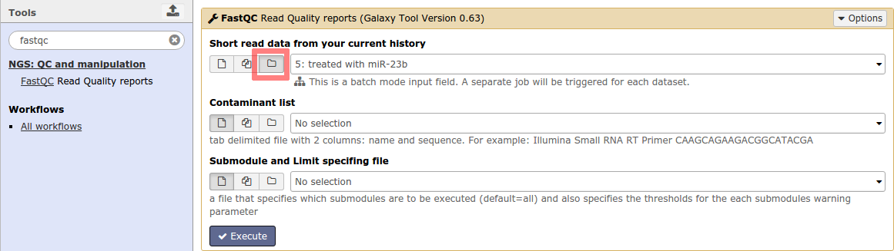
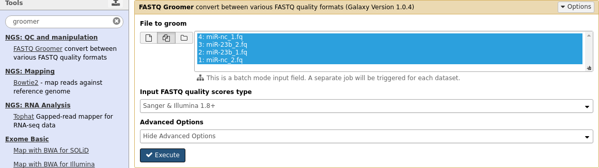
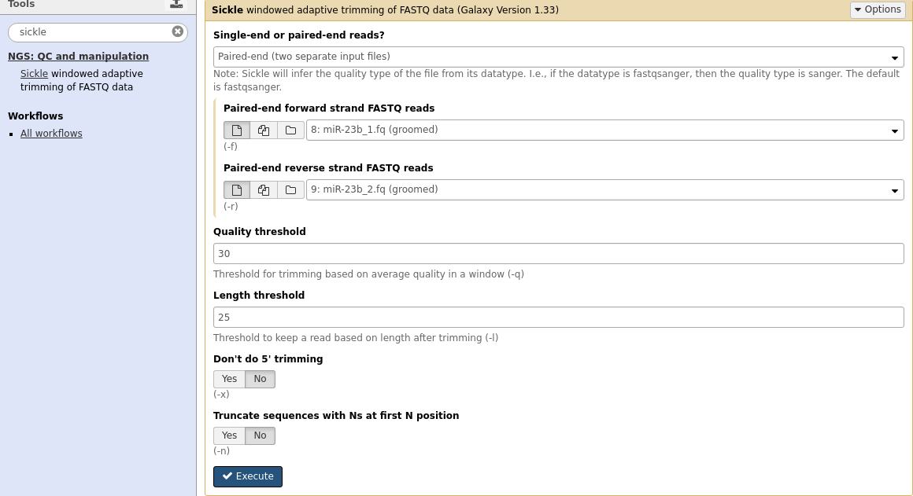
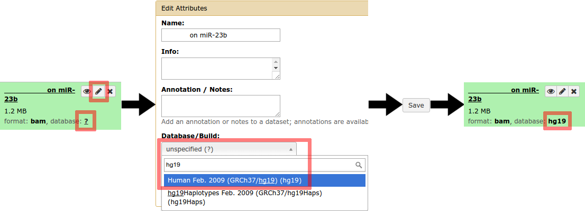
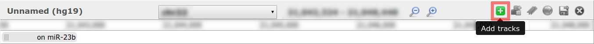
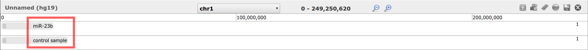
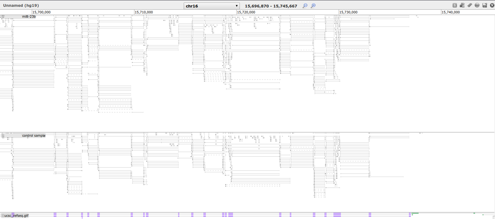

# RNA-Seq Differential Gene Expression

This practical aims to familiarize you with the Galaxy RNA-Seq analysis, the FastQ format
and data collections (pairs).

## Introduction
Due to the rapid development of Galaxy, screenshots and results may be out of date. If you experience something like this, please report it as a bug at the [training materials github repo](https://github.com/ErasmusMC-Bioinformatics/galaxy-courses/issues).

## Preparations
**Open Galaxy** Please open a web browser and navigate to the [Galaxy server](https://bioinf-galaxian.erasmusmc.nl/galaxy/) for this course.

**Login or Register** for an account. In the top menu bar, go to `User` and then choose `Login` to log in with an existing account or click `Register` to create a new account. After registration, click on `Analyze data` in the top menu to return to the main screen.

## Training

### RNA-Seq: QC/QA
The very first step of an RNA-Seq analysis is the quality control and quality assurance. The
sequencing data is usually provided in FASTQ format, which reports the sequenced bases and also describes per-base quality scores reflecting the probability it was measured correctly. However, different encodings are being used. Galaxy contains tools that assist you in determining and dealing with these formats by converting them to fastqsanger.

#### Paired-end data as dataset pairs within Galaxy
In Galaxy we can indicate that two datasets should be treated as forward and reverse data pairs in subsequent analysis steps. This section will show you how to create such dataset pairs.

Create a new history and import the following datasets from the shared data library (`EMC Training - RNA-Seq DGE Analysis`) into your history:

As you may expect from the file names, `_1` and `_2` indicate that these files are paired-end and belong together. To specify this in Galaxy, first select the checkbox at the top of the history (*Operations on multiple datasets*), and then select two history items that belong together and then press the button *For all selected...* to apply actions on multiple history items at once, and then select *Build Dataset Pair*. Galaxy does not inherently know which one is the forward and which one is the reverse, therefore make sure to check that `_1` is designated as the **forward** dataset and `_2` is the **reverse**. If Galaxy does not choose these files correctly be default, you can use the *Swap* option to switch these files around.

Repeat this process for both dataset pairs. One of the samples has been treated with *miR-23b* and the other is a control. Make sure you use names for your pairs that make this clear. After you have done this, you will see that you end up with 6 datasets in total, of which 2 are dataset pairs.

#### Fastq, Fastqsanger and FastQC
To obtain statistics on the data, find the tool `FastQC - Read Quality reports` in the tool menu. This tool, originally developed for DNA-Seq analysis, makes several summaries of the data and reports the summary in an HTML page. By default FastQC selects the individual fastq files for analysis. This is because FastQC does analysis just on one fastq file. When we choose to select one of our pairs, Galaxy will run FastQC twice on each dataset in the collection (or pair in our case) and merge the results into a new dataset collection. It is up to you whether you want to run them as pairs or seperately as single files, but make sure you run FastQC on all four of them to get an impression of the quality of the data. The figure below demonstrates how to run the tool

What follows is a quality report (raw data and HTML report) for each FASTQ file. Open the
`miR23b` (forward) FastQC report that contains `... : Webpage ...` in its name. This file should look
similar to this:

More information about the FastQC output report can be found in this [manual](https://bioinf-galaxian.erasmusmc.nl/public/GalaxyTraining/FastQC_Manual.pdf).

The Galaxy history items are all of the **fastq** format. This format is a general format that covers four
specific subformats that differ in their quality encoding. Before we proceed with the next step it is
important to understand the FASTQ encoding formats. They are described in detail on [wikipedia](http://en.wikipedia.org/wiki/FASTQ_format#Encoding).

In the FastQC report, scroll down to *Basic Statistics* and note what encoding is used in these files. This information is important later on in this practical, because other tools may require a specific sub-datatype instead of *fastq*. Therefore please write it down:
..............................

The more or less standard encoding is *fastqsanger*, which is the same encoding as *Illumina 1.8* and
*Illumina 1.9*, also referred to as *Illumina 1.8+*. To convert a fastq file into the standard type of encoding (*fastqsanger* in our case), we use the tool `FASTQ Groomer - converts between various FASTQ quality formats`. In this tool, make sure the quality encoding you wrote down matches the one in the input field. Furthermore, make sure you run it for each of the four datasets; we can do this at once by selecting the *Multiple datasets* option in the input data field.

This will add the groomed fastqsanger files to your history, with names that are not convenient. Please rename the datasets such that you can keep track of the sample name (e.g.: `control_1 (groomed)`, `control_2 (groomed)`, `miR-23b_1 (groomed)` and `miR-23b_2 (groomed)`) and, if you did not use pairs, whether the reads are forward or reverse.

If we go back to the FastQC webpage report, and look in section *Per base sequence quality*, we see the average quality per base for all reads. The colors green, orange and red indicate whether the quality is considered good, okay, or bad. As you can see, the quality drops as the sequences get longer. It is important to realize that low quality bases result more mismatches which do not reflect true genetic differences. This results in a higher amount of technical error and will therefore complicate alignment as well as SNP detection. To improve overall the base quality of the data, we would like to:

- Trim the low quality bases from the ends

- Remove reads of which the average quality is too low
- Remove reads that are too short

A tool that covers all of this is `Sickle - windowed adaptive trimming of FASTQ data`. Because we
have paired end data, we have to run it twice, once for miR-23b and once for the control. Run it
with the following settings:

After running a sickle analysis, rename the files *Singletons from paired-end ...* and *Paired-end output of Sickle on ...* to e.g.:

for miR-23b:

- miR-23b, singletons(clean)
- miR-23b 1 (clean)
- miR-23b 2 (clean)

for control sample:

- control sample, singletons(clean)
- control sample 1 (clean)
- control sample 2 (clean)

If desired, you can hide the other results, such that you will get a history similar to:

As you can see, Sickle produces for every set of paired sequencing reads, a set of pairs and an extra
file with *singletons*. Hence, for every two files that go in, three files come out.

- **Question:** *What would singletons be?*

To confirm that the base quality has improved, run the FastQC again on miR-23b (clean).
In Galaxy you can visualize multiple datasets in one screen with the Scratchbook option.
We are going to load the FastQC results before and after cleaning, in the same window, to see what has changed.
Press the following icons:

- Has the Per base sequence quality improved?
- Have the Per sequence quality scores improved?
- Why has the sequence length distribution changed?

FastQC also has a section *Overrepresented sequences*, indicated in red with a huge list. Apart from that we are using a truncated artificial dataset, it often happens in RNA-Seq data that these sequences appear. As said before, this tool was orignally written for DNA-Seq data.

- **Question:** *Could you think of a reason why sequences could be overrepresented in RNA-Seq data?*

### RNA-Seq: alignment
To make more sense of the RNA-Seq data, we try to locate the detected sequences back in a reference
genome (this is often called mapping and aligning). The reference genome should represent the most
common sequence of the chromosomes of the human population. Please read the first paragraph (3
sentences) of the following url: http://en.wikipedia.org/wiki/Reference_genome

- **Question:** *On how many individuals is hg19 based?*

For RNA-Seq we need specialized RNA aligners, able to cope with gaps that originate from splicing.
There are quite some of these aligners around. We will make use the tool `RNA STAR - Gapped-read
mapper for RNA-seq data`. Load the aligner, select the following settings and leave the rest on
default, and run an alignment for miR-23b (clean) and control sample (clean).

*NOTE: Alignment is a computationally very very heavy task, and it may take some time, please be patient and do not rerun the tool without stopping the previous job.*

Please rename the output `RNA STAR on ...: starmapped.bam` to `RNA STAR on miR-23b: starmapped.bam`
and `RNA STAR on control sample: starmapped.bam` or something else that makes it easy to rec-
ognize. If the alignments do not have their database (also referred to as **dbkey**) set, change it to
hg19 as follows:

To get some general alignment statistics, run the tool `Flagstat - tabulate descriptive stats for BAM
datset` on miR-23b.

- **Question:** *How many reads are multi-mapping (‘secondary’)?*

Up until now we have only seen FASTQ and summary files. To get an idea of what has been measured
during the experiment, we can visualize the alignment. So, in the alignment step we have been
looking in hg19 where these sequences originate from, and this information is stored in the BAM files.
Import from the Shared Data library  the file `ucsc refseq.gtf` into your history. Start the built-in
visualization Trackster at one of the alignments (make sure the database is set to **hg19**):

Give it a name, press *Create* and you will see a yellow bar, indicating that the bam file is being
prepared. This means that the bam file is being converted into a file format that the browser is able
to visualize.

When this job is done, and it contains no error messages in the bars, which should look like the
figure below, save it:

To add the other alignment, press the [+]-button:

Now select the other alignment and press Add and save it again:

Note that this is truncated data and you are supposed to see barely anything in here. Go to
*chr16*, to region `chr16:15696870-15745667`.

- **Question:** *Can you see where the introns and exons are located?*

To help you answer this question, you can add `ucsc refseq.gtf` that will visualize the exons and
gene structure of a refseq gene annotation. It will only be visible if its database of the history item
is set to hg19. Again, ensure this visualization is saved:

- **Question:** *Can you go to* `chr15:60688011-60688099` *and explain what is going on there?*

In the last question you can clearly see that you can observe biological facts from alignments where
you couldn’t extract this from the plain fastq files. Because looking through all alignments ’by hand’
is way too much work and prone to errors, we use these bam files for a variety of computer programs
to estimate metrics for you instead. These metrics can be insert size, expression levels, indel ratio’s,
etc., that may be used to test different hypotheses.

### RNA-Seq: QC/QA post alignment
Although we have ensured the base quality of our reads is high, there may be many other factors
we did not look into because they can only be deduced from the alignments. There are several tools
available to check for certain biases within alignments.

#### CollectRnaSeqMetrics
For this module, load the following files from the Shared Data Library: `paired-end-rna-seqmetrics.bam` and `ucsc refseq.gtf` and proceed with the tool `CollectRnaSeq-Metrics` as follows:

This analysis will take a while (couple minutes) and will return two files, a summary file and a PDF file. Take a look at the PDF. This pictures shows the average coverage per relative position within all genes. As you can see there is a bias towards the 5’ end. This means that overall more reads are aligned to the 5’ end of the genes, due to library preparation. For certain types of analysis (e.g. differential isoform expression analysis) it might be important to keep this information in mind.

#### Inner Distance
Import the following file from the Shared Data Library: `refseq-genes.bed` and proceed with the tool `Inner Distance` as follows:

The insert size is the size of the original cDNA fragment (minus the length of the mate pairs).  Because RNA-seq fragments are size selected, the fragments should be within a certain range, usually provided by the manufacturer. An easy way to estimate this is by calculating the insert size, the distance in between the mates. However, due to the gaps introduced by introns in RNA-Seq, the insert size may be much larger than the actual fragment size.

The tool `Inner Distance` corrects for splice junctions in the alignments and makes a plot of the distribution of the insert sizes. When you take a look at the result, you will first need to understand the x-axis. If the length of the both mates of a read is 100bp, and the insert size in the figure is 0, the length of the RNA fragment was 100 + 0 + 100 = 200nt. If the insert size in the figure is 25 (mean) and both mates are 100bp in length, the RNA fragment was 100 + 25 + 100 = 225nt. Given that the mean of the insert size is ∼ 25bp, the most abundant fragment size is 225nt.

Let’s assume the manufacturer said that the fragments are size selected between 200 and 500bp. You should be able to understand why there are insert sizes smaller than 0 (insert size smaller than 200) but also why they can be larger (technical and biological). There is also a small bulb of reads with an insert size even smaller than the fragment (200bp), meaning a negative fragment size. Of course, this is not possible. These are reads of which the forward mate is aligned after the reverse.

### Advanced Expression Analysis

#### Estimating gene expression
For this practical we need a RNA-seq alignments we previously made in the basic expression anal
ysis: `... miR-23b.bam`. If you do not have that file, you can find it in the Shared Data Library (`miR-23b.bam (clean)`)

Ensure that the file is annotated as reference genome hg19. To estimate expression in RNA-Seq,
we can count the number of reads that are aligned to each gene from the list of candidate genes. Therefore you also need to import the following file from the shared data library: `ucsc refseq.gtf`

This list is provided as a GTF/GFF file. There are a variety of tools available for counting reads. `FeatureCounts` is one of the faster tools and it works directly using BAM files. Find this tool in the tool menu:

Before we proceed, we would like to know whether the analysis has been performed correctly. Therefore we take a look at featureCounts’ output-summary file `featureCounts on ...`:

- **Question:** *How many reads are Assigned ?*
- **Question:** *How many reads are UnAssigned (sum of all)?*

Flagstat told us the alignment has 18258 or 19493 reads in total (different versions). Please confirm whether this matches with the total number of reads in the featureCounts summary file.

If we want to look at a particular gene, we may want to truncate the large table and only show the row with the gene of interest. To filter a tabular file we proceed with the following Galaxy tool: `Filter data - on any column using simple expressions`

- **Question:** *How many reads are aligned to DRAM1?*
- **Question:** *Which gene has the highest read count (tip: use `sort`)?*

#### Expression analysis: Low sequencing depth
In the previous exercise we found which gene had the highest read count, but what does it mean if this gene has a high read count all samples? To say something about expression levels, we would like to say it in a context relative to other samples. Therefore, we need normalization and apply statistical testing. A popular R package that allows to do this is **EdgeR**, which in galaxy fits perfectly with featureCounts.

In the following analyses you will determine the differentially expressed genes in the MCF-7-cell line between samples that have been treated with the hormone β-estradiol (E2) and those that were left as control [Liu et al., 2014]. The data was originally used to benchmark the statistical power of adding replicates and does not reflect a certain disease state. In this exercise we will reproduce a part of their experiment to highlight the importance of replicates. However, it is a 2-class problem and has a similar setup as often used in cancer analysis.

Before we proceed, please read the abstract of the following article: http://dx.doi.org/10.1093/bioinformatics/btt688

Tip: Look up from what tissue the MCF-7 cell line originates.

For this practical we made the read count tables from featureCounts already available. We will analyse the samples with a sequencing depth of ∼30M (full), 10M and 5M, for each replicate. Each analysis in this assignment will be to determine the number of differentially expressed (DE) genes and add this number to the following table (Table 1):

|Replicates | Seq. Depth | Significant DE genes |
|-----------|------------|----------------------|
|0 | 0 | 0 |
| 7rep 5M  | 5,000,000  | ............. ? |
| 7rep 10M | 10,000,000 | ............. ? |
| 7rep 30M | 30,000,000 | ............. ? |
| 5rep 30M | 30,000,000 | ............. ? |

Import the following files from data library:

- `GSE51403_expression_matrix_5M_coverage.txt`
- `GSE51403_expression_matrix_10M_coverage.txt`
- `GSE51403_design_matrix_subsampled.txt`

The design matrix provides the mapping from the RNA-seq read counts per sample to the phenotype
class each is associated with. Please take a look at file GSE51403_design_matrix_subsampled.txt

- **Question:** *Given that the first column lists the names of the samples and the second column the samples’ corresponding condition, how many conditions does the experiment have?*

##### Subsampled datasets: 5M, 7+7
For our experiment we have a 2-classes setup: a class treated with estradiol is called *E2*, and the other is called *Control*. Take one more look at the design matrix and see if you can find samples that belong to these classes. Go over the following steps to find the differentially expressed genes between *E2* and *Control* using 7 replicates per condition and 5 million reads per sample.

*NOTE: although the design matrix contains a class description for all samples, also with 10M, 25M reads and class “Unknown”, while the expression matrix contains only those for 5M reads, the edgeR wrapper will link the samples based on their sample name and proceed with those.*

- Load the tool `edgeR: Differential Gene(Expression) Analysis RNA-Seq gene expression analysis using edgeR (R package)`
- Choose **Analysis type:** Multigroup test and/or complex designs with e.g. blocking
- Choose **Expression (read count) matrix:** GSE51403_expression_matrix_5M_coverage.txt
- Choose **Design matrix:** GSE51403_design_matrix_subsampled.txt
- Define **contrast:** this is the more complicated part of the tool. It is effectively defining the
hypothesis we want to test. This is done via a mathematical formulation in a format described
by a well known R package limma. For two-class problems it is very simple: *classNormal-
classTreated* which in our case is: `Control-E2` (case sensitive!)
- Set **Report differentially expressed genes** to *Only significant (defined by FDR cutoff)* and
ensure the cutoff is set to 0.01.
- Don’t select additional output files and leave the rest default.
- Click `Execute`

It is always important to check whether we did not make obvious mistakes. Take a look at the file `edgeR DGE on ...: GSE51403 design matrix.txt differentially expressed genes`. If everything is correct, the gene GREB1 is located in the top of the file. Please check its corresponding gene cards page: http://www.genecards.org/cgi-bin/carddisp.pl?gene=GREB1

- **Question:** *Can you find on the gene cards page a regulatory factor of the gene that relates to the E2 treatment? (Hint: what was E2 again?)*
- **Questions:** *Can you find on the gene cards page an association with MCF-7 cells? (Hint: what is MCF-7 for type of cell line?)*

The answers to the questions should confirm that what we found with the expression analysis is in agreement with the biology behind it. If we go back to the output file, each line represents one gene, indicated by the gene symbol in the 2nd column. Because the table is ordered by FDR, the first column is the original position in the GTF file. The P-value, 6th column, is a probability that represents the chance to find the read counts that belong to the gene, given that they are from the same condition. The FDR is a multiple testing correction of the P-value and is usually used instead of the P-value. The lower this value, the less likely it is that the observed values are derived from the same condition. Thus, differentially expressed genes will have a low FDR and P-value for determining significance. To distinguish between differences considered to be caused by chance or by the different conditions, we make use of a cut-off, commonly set to ≤ 0.01 or ≤ 0.05.

In edgeR we already selected to only return those genes with a FDR ≤ 0.01. Hence, the number of lines in the history, minus 1 (header line) should give us the number of differentially expressed genes.

- **Question:** *How many genes are significant differentially expressed between Control and E2? (Please fill this in into the table above)*

##### Subsampled datasets: 10M, 7+7
In the previous analysis, the original FASTQ files used to generate the read count table, contained a total of 5.000.000 reads per sample. For the next analysis we will make use of twice the amount of raw data to see how the number of differentially expressed genes change: 10M reads per sample, 7 samples per condition.

- Re-run the previous job with the rerun icon
- Replace **Expression (read count) matrix:** `GSE51403 expression matrix 5M coverage.txt` with `GSE51403 expression matrix 10M coverage.txt`

- **Question:** *How many genes are significant differentially expressed between Control and E2? Is this more or less than when we used 5M reads? (Please fill this in into the table)*

##### Subsampled datasets: 30M, 7+7
In the previous analyses, the FASTQ files contained a total of 5.000.000 or 10.000.000 reads per sample. The full data set contains more or less 30.000.000 raw reads per sample. Import the following files from shared data:

- GSE51403_expression_matrix_full.txt
- GSE51403_expression_matrix_full_5x5.txt
- GSE51403_design_matrix_full_depth.txt

Proceed with the following steps:
- Re-run the previous job with the rerun icon
- Replace **Expression (read count) matrix:** `GSE51403 expression matrix 10M coverage.txt` with `GSE51403 expression matrix full.txt`
- Replace **Design matrix:** `GSE51403 design matrix subsampled.txt` with `GSE51403 design matrix full depth.txt`

- **Question:** How many genes are significant differentially expressed between Control and E2? (Please fill this in into the table)

##### Subsampled datasets: 30M, 5+5
We did three tests with 7+7 replicates and different sequencing depths. To see what the effects are of sample replication, we should run the same analysis but use a different number of replicates. To modify expression matrices within Galaxy (both concatenating and removal) we can make use of the tool `edgeR: Concatenate Expression Matrices Create a full expression matrix`. We have used all our replicates in the previous analyses and so we can reduce the number of replicates to 5+5 by simply picking a subset:

This will create a truncated version of the expression matrix, only including the desired 5+5 replicates.

- For convenience, rename the new expression matrix to: `GSE51403_expression_matrix_full_5+5_replicates.txt`
- Re-run the previous edgeR DGE job with the rerun icon, make sure that the design matrix is `GSE51403 design matrix subsampled.txt`
- Replace **Expression (read count) matrix:** `GSE51403 expression matrix full.txt` with `GSE51403 expression matrix full 5+5 replicates.txt`
- **Enable** the optional output: MDS-plot (logFC-method)
- Set the **Output format of images** to: Portable document format (.pdf )

- **Question:** *How many genes are significant differentially expressed between Control and E2? (Please fill this in into the table)*

Take a look at the MDS plot. If you want to understand all details about MDS you should do some research online because it is a complicated mathematical operation. For now, what matters is 13that the distances between the samples in the plot should correspond more or less to the distances between the samples based on the expression of all (22.000) genes. Hence, samples that are far apart in this plot, differ more in their expression profile, and samples that are close to each other, have a more similar expression profile.

- **Question:** *Do you see separation between the samples from E2 and Control?*
- **Question:** *Could you think of an application where it would be desired to see separation between classes?*
- **Question:** *Would you expect more or less differentially expressed genes if the experiment was done on individual patient samples instead of cell-line replicates?*

Can you create a tab delimited file of the table, e.g. in notepad or Excel, and upload it as a `tabular` file within Galaxy? If you are not able to create the file, you can pick the file from the data library (table 01)

Try to open the table in Galaxy as Scatterplot (visualization on the history item) and discuss with other people about the impact of removing these 2 replicates on the statistical power:

You are finished!

### Bonus question
In case you can’t get enough of it, go to the Shared Data bonus section and answer the following question:

- **Question:** *To which classes do the Unknown samples belong? (hint: MDS)*

## References
Yuwen Liu, Jie Zhou, and Kevin P. White. Rna-seq differential expression studies: more sequence
or more replication? Bioinformatics, 30(3):301–304, 2014. doi: 10.1093/bioinformatics/btt688.
URL http://bioinformatics.oxfordjournals.org/content/30/3/301.abstract.
