# EMC Galaxy Training - 2: Variant Analysis (DNA)

In this tutorial we will perform some basic variant detection on (a subset of) NGS whole-genome data. We will assess the quality of our raw reads, map them to the reference genome, view our data in Galaxy's built-in genome browser (Trackster), and detect and annotate single nucleotide variants from our data.

Parts of this tutorial were taken from a Genomics Virtual Lab (GVL) tutorial. The GVL also offers various other Galaxy (and non-Galaxy) tutorials: https://genome.edu.au/wiki/Learn

## Preparations
1. **Open Galaxy**

  Please open a web browser and navigate to the Galaxy server:

  https://bioinf-galaxian.erasmusmc.nl/galaxy

  It is recommended that you use Firefox or Chrome for this tutorial (not IE)
2. **Log in to your account**

   In the top menu bar, go to User and then choose Login. The instructors will provide you with login credentials.

## 0. Get the Data
The data has been produced from human whole genomic DNA. Only reads that have mapped to a part of
chromosome 20 have been used, to make the data suitable for an interactive tutorial. There are about one million 100bp reads in the dataset, produced on an Illumina HiSeq2000. This data was generated as part of the 1000 Genomes project: http://www.1000genomes.org/

The data needed for this practical session is located in a Data Library (top menu under Shared Data) named “EMC Training - Variant Analysis (DNA)”.

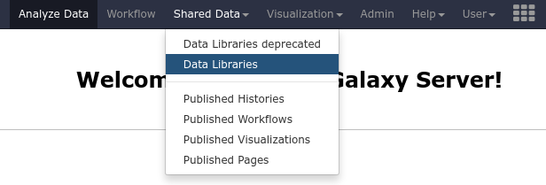

The files to import are:
```
NA12878.hiseq.wgs_chr20_2mb.30xPE.fastq_1
NA12878.hiseq.wgs_chr20_2mb.30xPE.fastq_2
```

Select these files from the list, and at the top press the button labelled *to History*.

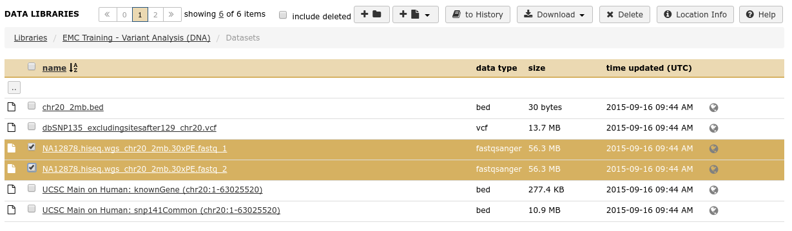

## 1. Quality Control
The aim here is to evaluate the quality of the short data. If the quality is poor, then adjustments can be made, e.g. trimming the short reads, or adjusting your expectations of the final outcome!

-  **View the fastq file**
   by clicking on the eye icon of your history item. A FASTQ file normally uses four lines per sequence.

    - Line 1 begins with a '@' character and is followed by a sequence identifier and an optional description
    - Line 2 is the raw sequence letters.
    - Line 3 begins with a '+' character and is optionally followed by the same sequence identifier again.
    - Line 4 encodes the quality values for the sequence in Line 2, and must contain the same number of symbols as letters in the sequence.

More information about the fastq format can be found here http://en.wikipedia.org/wiki/FASTQ_format

- **Analyse the quality** of the reads using the tool FastQC

  - In the tool panel, type fastqc in the search panel to locate the tool.
  - Select the first fastq file as the input dataset
  - Leave all parameters to their default settings and hit execute.
  - You will get two output files, RawData and Webpage.
  - Examine the FastQC webpage output by clicking on the eye icon . Look at the
  various quality metrics. A good description of the various plots in the fastqc output can be found here: https://bioinf-galaxian.erasmusmc.nl/public/GalaxyTraining/FastQC_Manual.pdf


This data looks pretty good, high per-base quality scores (most above 30).

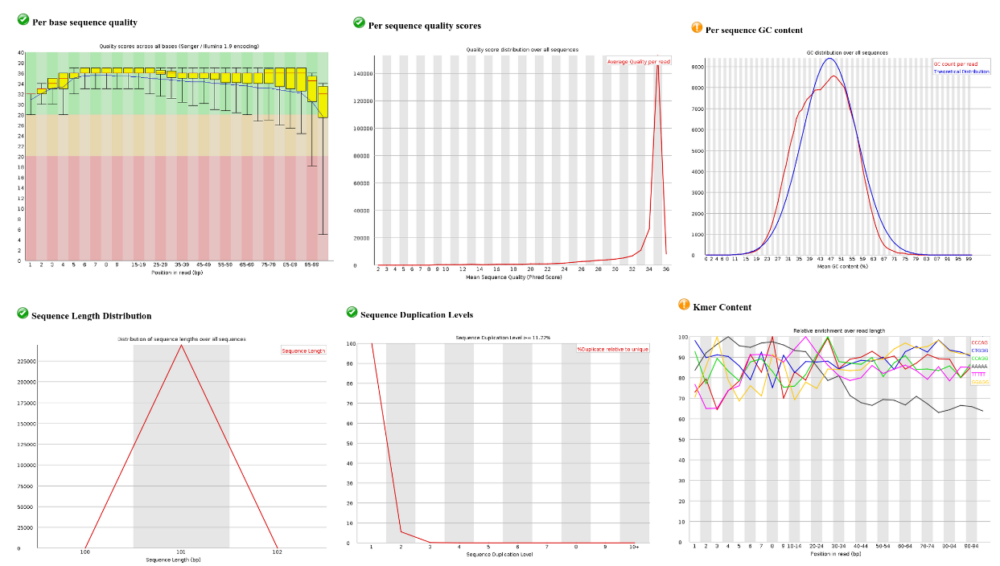

If our data had looked bad, we could have used various tools to trim low-quality bases from the reads or throw out low-quality reads altogether. But in our case we can use the data as-is.


## Alignment and Visualisation

The basic process here is to map each of the individual reads in the sample FASTQ readsets to a reference genome, so that we can then identify the sequence changes with respect to the reference genome.

- **Map/align the reads** with BWA to Human reference genome 19 (hg19)
  - Tool: Map with BWA-MEM
  - Load reference genome from: Use a built-in genome index
  - Reference genome: Human (Home sapiens): hg19
  - Single or paired-end reads: Paired end
  - Forward FASTQ file: NA12878.hiseq.wgs_chr20_2mb.30xPE.fastq_1
  - Reverse FASTQ file: NA12878.hiseq.wgs_chr20_2mb.30xPE.fastq_2
  - Leave everything else to default settings

NOTE: This step will take several minutes, but you can continue with the next step already. Galaxy will detect that the input file for the next step is from a tool that is still running, and will queue the job until the previous alignment step has finished.

The output is in BAM format (compressed version of the SAM format). A good description of the format can be found here: http://samtools.github.io/hts-specs/SAMv1.pdf2.

- **View your mapped reads** in Trackster

  Galaxy has a built-in genome browser, Trackster. To view you data in Trackster:
  - Go to the BAM file history item, and click on the graph symbol:  
  - Select the option: *View in new visualisation*
  - Choose a name for your visualisation and check that the reference genome is set to hg19

  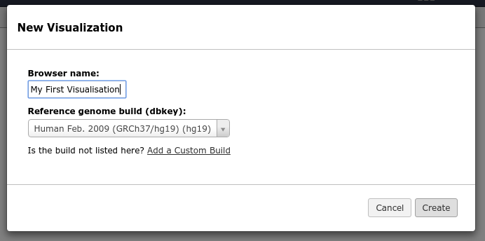

  - Once Galaxy is finished preparing the data, navigate to a location somewhere in the first 2 MB of chromosome 20 (e.g. chr20:937,401-945,633) by clicking on the chromosomal location at the top and pasting the coordinates in the text field that appears.

  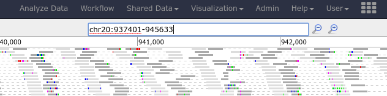

  - You should now see some reads mapped here. You can change the Display Mode by hovering over the name of the track and clicking the first button. Set the display mode to “Squish”.

  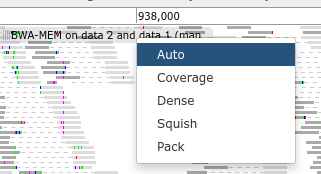

  - Save your visualisation so you can return to it later (top right) ( **important!** )

To see where we are in the genome, we can load additional tracks, for instance tracks containing the locations of the genes and exons, or a track with common SNPs.

- **Fetch additional data tracks** from the UCSC main table browser
  - You got such files from the UCSC table browser in the first tutorial session for chromosome 22. In the data library there are similar files for chr20.
  - Go to: *Shared Data → Data Libraries → EMC Training - Variant Analysis (DNA) → Datasets*. (Say yes to leaving the current page if your browser asks, make sure you have saved your visualisation though!)
  - Import the following two files to your history:
  	 UCSC Main on Human: knownGene (chr20:1-63025520)
  	 UCSC Main on Human: snp141Common (chr20:1-63025520)
  - Return to you visualisation by navigating to *Visualization → Saved Visualizations*
  - Add tracks for each of these two files by clicking on the ``+`` symbol in the top right-hand corner and navigating to the two files you just imported.

    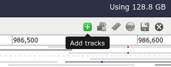

The bottom two tracks will now show the locations of the genes (and exons) as well as the common snps from dbsnp141. Change the display mode of these tracks to the one you prefer.

- Look around in Trackster, you can zoom in and out, and drag the screen to move left or right.

- Can you find a common SNP that is present in this sample? what is the SNP ID (rs number)?
(Hint: set the display option of the SNP track to `Pack` to get the identifiers to show)

- Is it a homozygous or heterozygous SNP?

**NOTE**: If you cannot find any common snps in the sample, try going to the following location: chr20:985714-986628. Here we see that SNPs rs6108282 and rs6086845 are clearly present in our sample. They are also present on every read overlapping the position, so this is good evidence of a homozygous SNP at these locations.

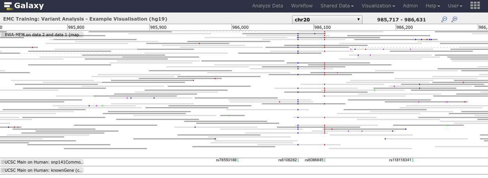

Visualisation can also be shared with specific other Galaxy users, or all Galaxy users, or made public. The above visualisation can also be found under: *Shared Data → Published Visualisations → EMC Training – Variant Analysis – Example Visualisation*

## Single Nucleotide Variant calling with VarScan2
Varscan2 is variant genotyper which assesses the likelihood of each possible genotype for each position in the reference genome, given the observed reads at that position, and reports back the list of variants (positions where a genotype different to homozygous reference was called).

- **Call variants** with Varscan2

  - Tool: *VarScan2 Call SNPs from BAM*
  - Select the output from BWA-MEM as the input file
  - Fasta Source: Autodetect
  - Leave all other settings to default


The tool outputs variants in VCF format. This file lists all the (single nucleotide) variants found by the variant caller. You can view more information about the file by expanding the history item. To view the entire you can click on the eye icon.

- How many SNVs did it find?
- Were all variants located in expected region? (remember, this is data from chr20)
- What could be a possible explanation for variants being called outside
chromosome 20?

A description of the VCF format can be found here: http://samtools.github.io/hts-specs/VCFv4.1.pdf

**NOTE**: Always remember that variant calling is a non-trivial problem, and different variant callers will output different sets of variants. Any method will generate both false-positives and false-negatives. Each method has their own strengths and weaknesses; some callers may be good at calling deletions but not as good at calling insertions, while others are great at calling insertions but have more trouble with deletions. Take-home message here is to remember that no variant calling algorithm is perfect. For instance, for this dataset, these
three different variant callers had the following overlap in SNVs called:

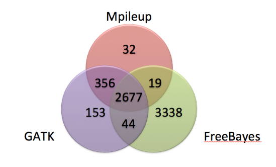

## Annotation
There are many tools for the annotation of variants. In this tutorial we will be using *ANNOVAR* (http://www.openbioinformatics.org/annovar/) to annotate our variants. ANNOVAR offers a wide range of annotations and can take various file formats as input, including VCF, Complete Genomics varfiles, and generic bed-like formats where the user can specify which columns contain the chromosome name, start and end position, etc.

- **Run ANNOVAR**
  - Tool: *Annotation → ANNOVAR Annotate a file using ANNOVAR*
  - Reference: hg19
  - Filetype: VCF4 file
  - Select the databases:
    - RefSeq, dbSNP 138NonFlagged, ESP6500 ALL
    - and from the functional impact scores, select: SIFT, PolyPhen2 HVAR
    - and set “Also get predictions where possible” to yes.


- **Examine the results**

  Have a look at the output. The output is a tabular file, containing all the original columns from the VCF file, with additional columns per annotation chosen.

- **Find exonic SNVs**

  Say you are interested in obtaining the set of variants located in coding regions. The VCF file we currently have contains all SNVs called from whole-genome sequencing data, so will contain mostly intronic and intergenic SNVs.

  - **Examine the ANNOVAR output** file and determine which column number contains the RefSeq_Func
  annotation, and what some of the possible values are.

  - **Filter the annotated variants** for exonic SNPs
    - Tool: Text Manipulation -> Filter Columns filter file based on column values
    - *Select column to filter on*: `16`
    - *Remove line in column value.. *: `not equals`
    - *enter number or string unless above option was set to empty or nonempty*: `exonic`
    - optionally enter a name for the output file

    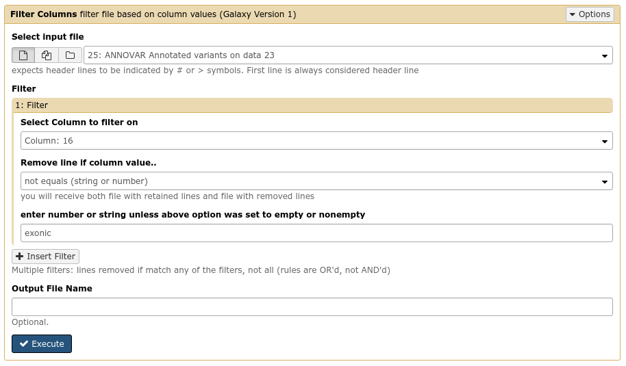

    **Q:** How many exonic variants were present in the file?

- **Find high-impact variants.**
  For this we use SIFT and Polyphen scores obtained via the ANNOVAR tool, and compute a consensus score with the ConDel tool (http://www.ncbi.nlm.nih.gov/pmc/articles/PMC3071923/).
  1. **Run ConDel**
    - Tool: Annotation → Condel
    - Input: filtered ANNOVAR output file from the previous step,
    - Parameters: indicate the column numbers of the SIFT and PolyPhen annotations.
  - **Examine** the output file
    - Note the column number containing the impact score as determined by ConDel
  - **Sort** the variants by their impact score, so that the highest-impact variant are on top.
    - Tool: *Filter and Sort → Sort*


  **Q:** Which variant has the highest consensus impact score?

## The End! Nice Job!

You have now performed a full analysis from raw sequence reads to a list with exonic SNVs ranked by
predicted functional impact score.
Time permitting, you can continue on with the next section, turning your analysis history into a workflow, so that the next time you have a set of fastq file, you can rerun the entire analysis pipeline on your new data in at once.

## Extra Credit: Create a Variant Analysis Workflow
One of Galaxy's main strengths is the ability to create workflows. It was quite a bit of clicking to get the variant analysis done today, but once you have performed your analysis once, it is easy to create a workflow from your history so that the next time around you don't have to perform all the individual steps again, but can simply repeat your entire analysis pipeline in one go.

- **Clean up your history.**
  In Galaxy you can extract a workflow directly from your analysis history. When performing analysis manually, you may make mistakes in parameter setting causing jobs to fail or not give the desired output, so it is always a good idea to clean up your history before extracting a workflow from it:
  - Remove any failed (red) jobs from your history
  - Remove any duplicate jobs from your history (if you ran a job twice because you used the wrong setting
  the first time, please remove the first job from your history)
  - Remove any files/jobs you don't want or need in your workflow


- **Extract workflow** from history
  - Click on the gear icon at the top of your history pane, and select *Extract Workflow*
  - In the next window you can deselect any files or jobs you do not wish to extract.
  Check that there are no redundant or unnecessary steps included
  - Name your workflow at the top of the window, and select Create Workflow


- **Check your workflow** in the workflow editor

  After the extraction is complete, click on Workflow in the top menu bar, here you should find the workflow you just created.  
  - Click on your workflow and select the “edit” option
  This will load the workflow editor, where you can graphically adjust your workflow, add tools, change parameters, connect outputs from one tool to input of next, etc.Let's rename our input files to a meaningful name, so that in future runs we know which of the input files
  should be the forward reads and which should be the reverse reads.
  - Find the input dataset connected to the first input of BWA-MEM and click on the box
    - On the top right-hand side, change the Name to “Forward Reads”
  - Rename the other input dataset to “Reverse Reads”
  - Save the workflow by clicking on the gear icon at the top right-hand side (important!)


- **Run workflow** in its entirety

  Now that we have our workflow ready, next time we get fastq files from our sequencer, we just run the entire pipeline and end up with the exonic variants ranked by their consensus functional impact score.

  **NOTE:** if you had trouble creating the workflow in the previous step, you can import the workflow from

  `Shared Data → Published Workflows → EMC Training: Variant Analysis (DNA) Example Workflow`
  - Create a new history and give it a name (gear symbol → create new)
  - Import the two fastq files from the data library again
  ( Shared Data → Data Libraries → EMC Training – Variant Analysis (DNA) → Datasets )
  - Go to Workflow, click on your workflow and select run
  - In the next window, select your forward and reverse fastq files, leave the rest of the setting as they are.
  - Click on Run Workflow at the bottom of the screen
  - Your entire analysis will now be performed automagically.

  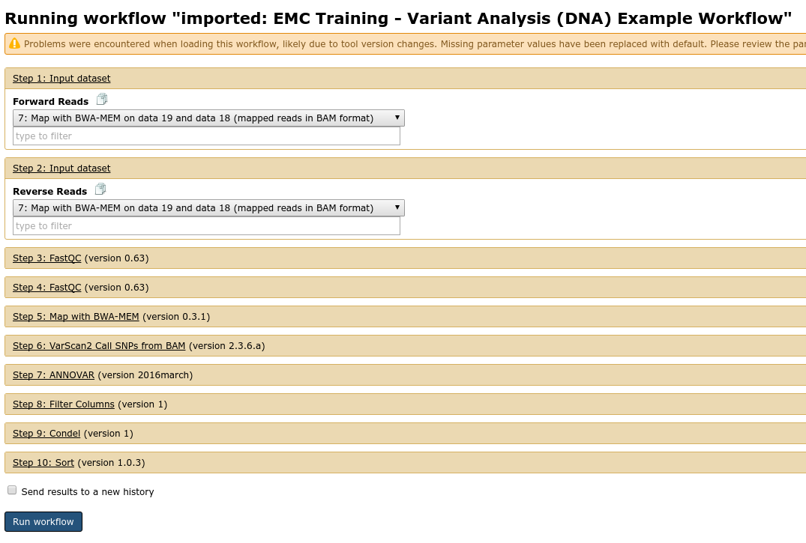

- **Share your work.**
  Now that you have your workflow built, you can share it with others. Galaxy offers three ways of sharing your workflows (and histories)
    1. **Make accessible via link**. This generates a web link that you can send to other people so that they can view and import your workflow
    2. **Make accessible via link and Publish**. Not only is a weblink created, but your workflow will also appear under *Shared Data → Published workflows*, which all users of this Galaxy will be able to see.
    3. **Share with a user**. Only share with specific users. Enter email addresses or those people you wish to grant access to your workflow. When this user now clicks on the Workflow menu, they will see your   shared workflow under the heading *Workflows shared with you*.


  - Go to Workflow in the top menu bar
  - Click on the workflow you just made and select Share or Publish
  - Share your workflow with the person sitting next to you.
  - Try to access the workflow that was shared with you by your neighbour by going to Workflow and looking at the section Workflows shared with you by others

The end! Well done!
